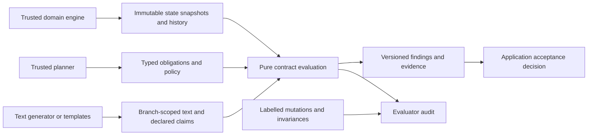

# Architecture

The authority boundary is explicit:

## Packages

- `mateprobe`: immutable models, protocol, rules, strict JSON loader, CLI, adapters and mutation audit. Standard library only.
- `pytest-mateprobe`: optional pytest entry point, fixture, assertion diagnostics and report export.
- `benchmarks`: authored feasibility corpus, explicit simple baseline, controls and source-code mutation experiment.
- `paper`: draft, limitations, references and the protocol for an independently validated study.

## Extension interface

Implement `Contract`: `rule_id`, class-level `version` and `kind`, `configuration()` returning canonical JSON data, and `evaluate(document, context)` returning nonempty attributed `Check` objects. The `Rule` base provides configuration and result helpers for frozen dataclasses.

A custom rule is trusted application code. It must have no random, network, filesystem or global-state dependencies during evaluation. The engine catches rule exceptions and emits blocking errors. Invalid or nonserializable configuration is a setup error, not a passing evaluation. A configuration digest identifies supplied settings and declared rule versions; it is **not** a cryptographic identity of Python implementation code. Release artifacts and dependency versions must also be recorded for research replication.

## Reproducibility

Documents, contexts, claims and built-in rule configurations are dataclasses. Context defensively copies its mappings into read-only snapshots. Canonical UTF-8 JSON, SHA-256, explicit policy, stable ordering and no timestamps yield identical reports for identical inputs and rules. Audit outputs include a digest of the labelled case corpus.

`library_version` identifies implementation release; `version` on each rule must change when semantics change. JSON output is schema version 1. Runtime performance records are stored separately because wall time is not deterministic.

## Scope

This release checks supplied state snapshots; it has no graph explorer, global liveness guarantee, entailment model, natural-language parser, automatic claim extractor, model provider or repair loop. LifeCard continues to own state transitions and reachability. A library consumer may supply bounded model-checking results as facts, with the bound and provenance recorded outside this scalar state API.

Policy controls blocking separately from measurement. Default strict policy blocks violations, unknowns and errors; heuristic violations can be advisory. `complete` means no check returned unknown/error, **not** complete semantic coverage of the document.
